# Wichtige Links {.section-slide}

::: {.links}
[Moodle](https://moodle.fhnw.ch/course/view.php?id=68364) ·
[Programm](https://drive.switch.ch/index.php/s/MO8exIExb8XqPY8)
:::

# Bildungssystem Schweiz {.section-slide}
*Volksschule · Sek II · Tertiär*

# EDK

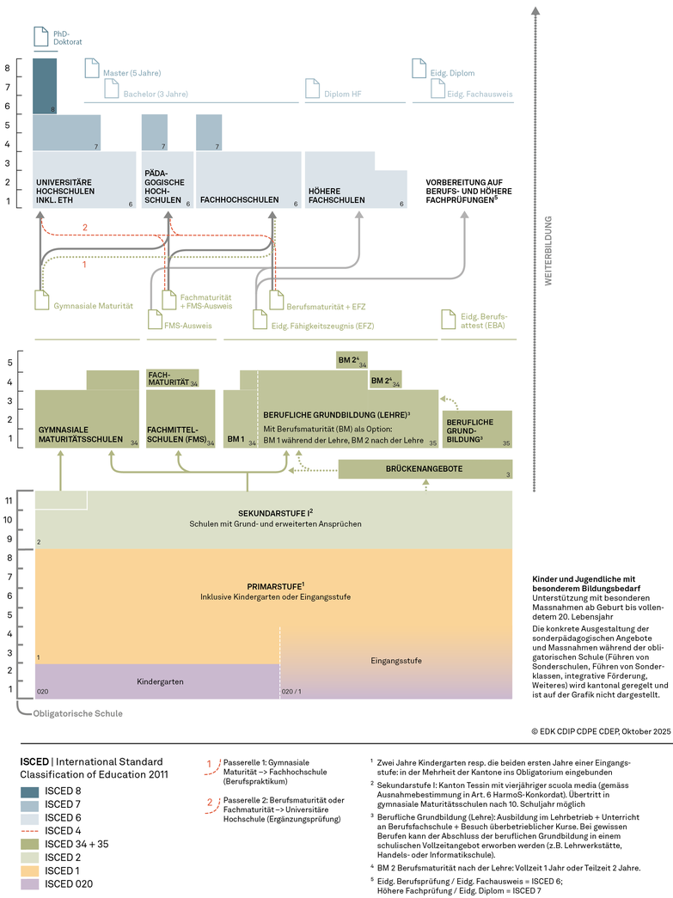{width=100%}

::: {.links}
[EDK: Grafik Bildungssystem Schweiz](https://www.edk.ch/de/bildungssystem/grafik)
:::

# Kanton Basel-Stadt

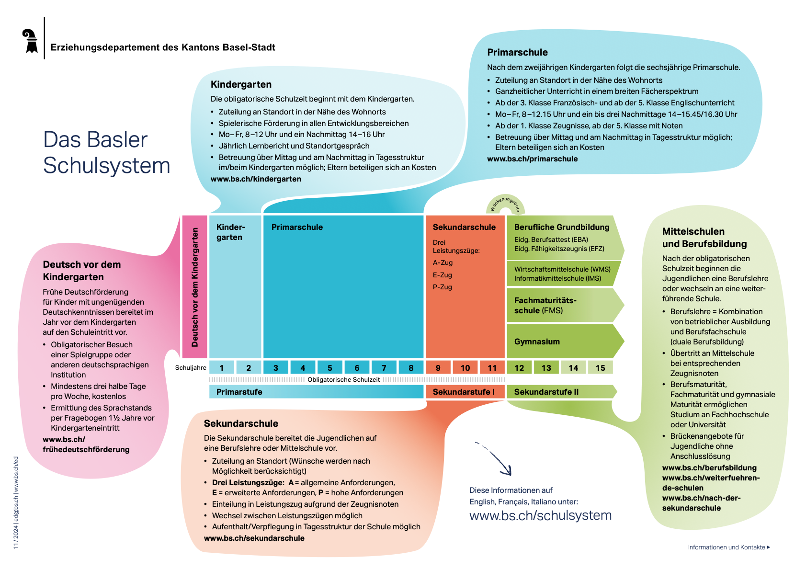{width=100%}

::: {.links}
[Kanton Basel Schulsystem](https://www.bs.ch/themen/bildung-und-kinderbetreuung/schule/das-schulsystem)
:::

# Kanton Basel-Landschaft

{width="525px"}

::: {.links}
[Kanton Basel-Landschaft Schulsystem](https://www.hallo-baselland.ch/de/schule-und-bildung/bildungssystem)
:::

# Kanton Aargau – Volksschule

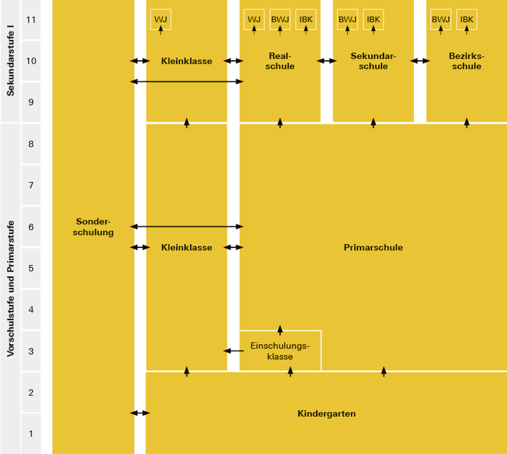

::: {.links}
[Kanton Aargau Volksschule](https://www.ag.ch/de/themen/bildung-forschung/volksschule/regelschule/struktur-organisation/schulstufen)
:::

# Kanton Aargau – Berufsbildung

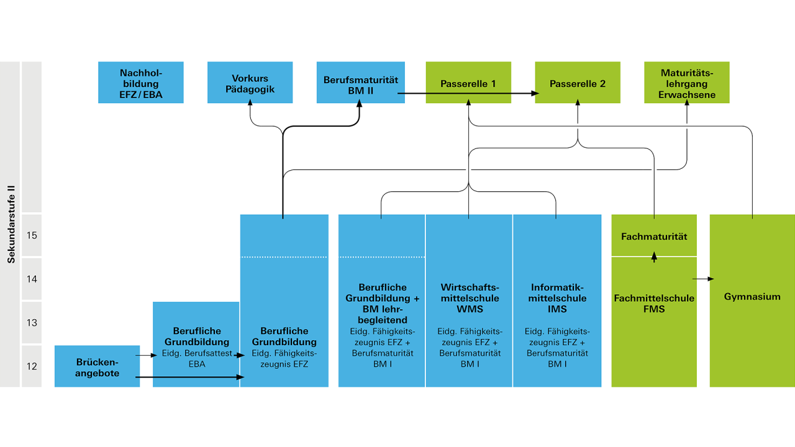{width="300px"}

::: {.links}
[Kanton Aargau Sek II Berufsbildung](https://www.ag.ch/de/themen/bildung-forschung/berufsbildung)
:::

# Kanton Aargau – Gymnasium

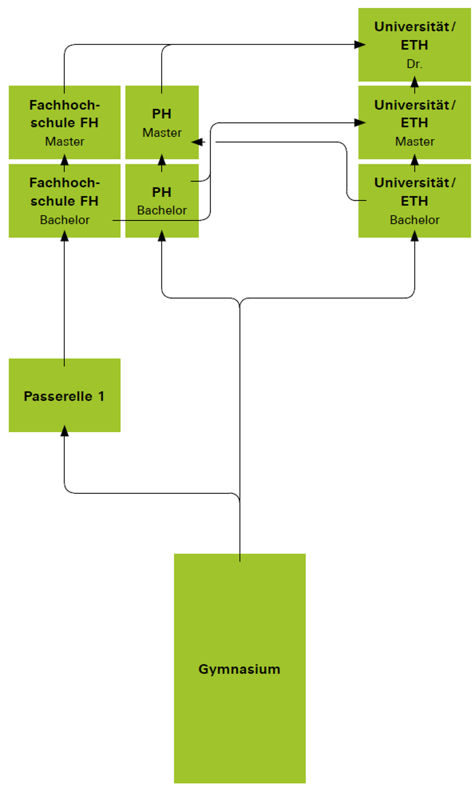

::: {.links}
[Kanton Aargau Sek II Allgemeinbildung Gymnasium](https://www.ag.ch/de/themen/bildung-forschung/mittelschulen/gymnasium)
:::

# Kanton Aargau – Fachmittelschule

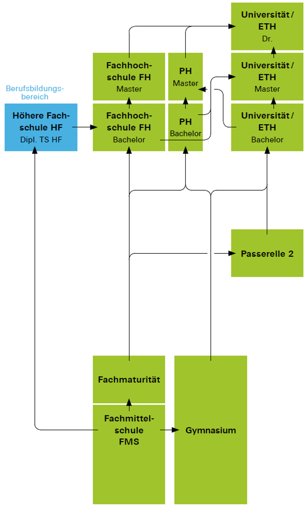{width="338px"}

::: {.links}
[Kanton Aargau Sek_II_Allgemeinbildung_Mittelschule](https://www.ag.ch/de/themen/bildung-forschung/mittelschulen/fachmittelschule)
:::

# Kanton Aargau – Wirtschafts- und Informatikmittelschule

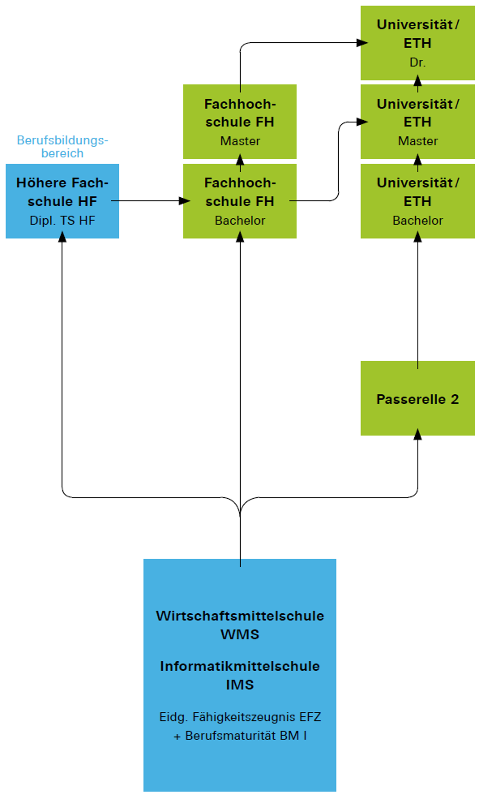{width="403px"}

::: {.links}
[Kanton Aargau Sek_II Berufsbildung: Wirtschaftsmittelschule](https://www.ag.ch/de/themen/bildung-forschung/mittelschulen/wirtschaftsmittelschule), 
[Infromatikmittelschule](https://www.ag.ch/de/themen/bildung-forschung/mittelschulen/informatikmittelschule)
:::

# Kanton Aargau – Tertiär

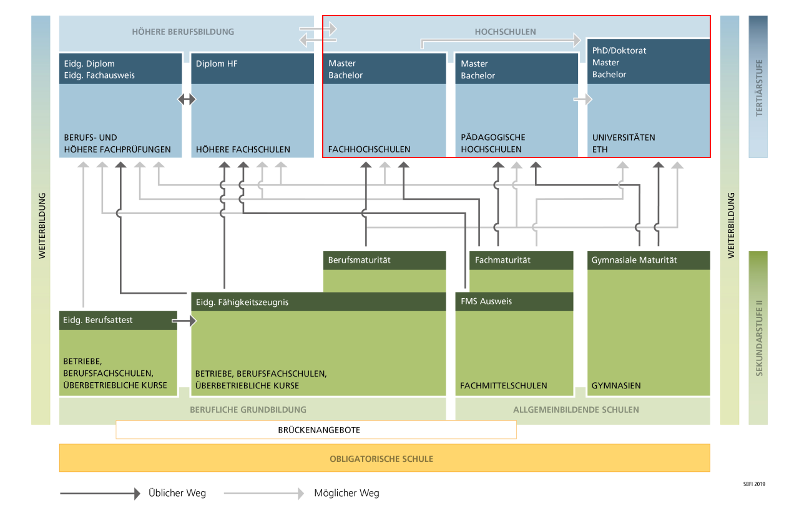

::: {.links}
[Kanton aargau Tertiär](https://www.ag.ch/de/themen/bildung-forschung/hochschulen)
:::

# Kanton Solothurn

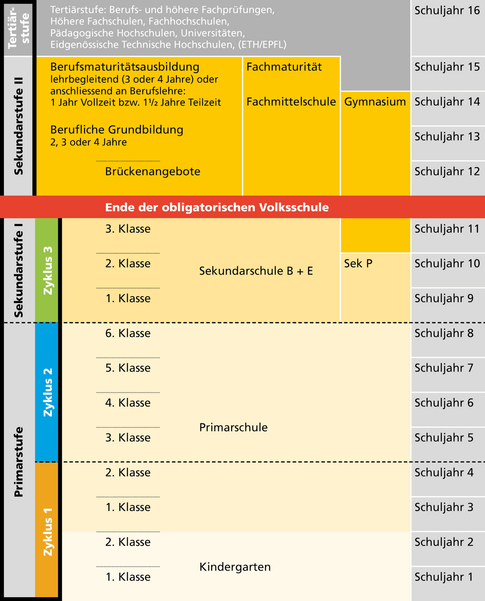{width="367px"}

::: {.links}
[Kanton Solothurn Bildungssystem](https://so.ch/verwaltung/departement-fuer-bildung-kultur-und-sport/volksschulamt/schulsystem/)
:::

# Sekundarstufe II – SBFI

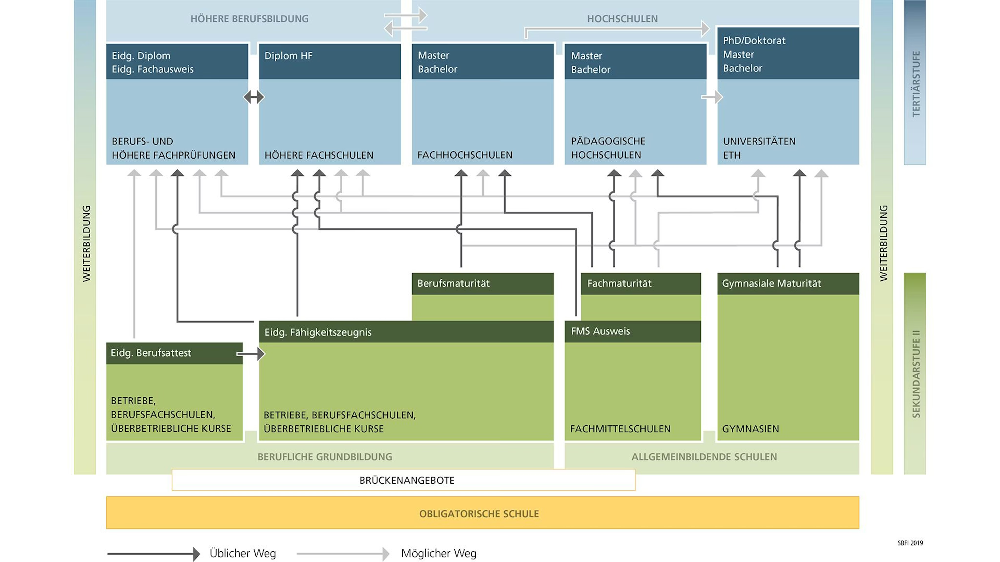{width="478px"}

::: {.links}
[Staatssekretariat für Bildung Foschunng und Innovation SBFI Bildungssystem](https://www.sbfi.admin.ch/de/bildungssystem-schweiz)
:::

# Tertiärstufe

 

| **Tertiär A – Hochschulen** | **Tertiär B – Höhere Berufsbildung** |
|---|---|
| ETH Universitäten Fachhochschulen Pädagogische Hochschulen | Höhere Fachschulen (HF) Weiterbildungsanbieter Prüfung |
| Doktorat Master  Bachelor |   Höhere Fachprüfung (HFP) -> Eidg. Diplom, *Professional Master* Berufsprüfung (BP) -> Eidg. Fachausweis *Professional Bachelor* Dipl. … HF, *Professional Bachelor*|

# Höhere Berufsbildung – Tertiär B

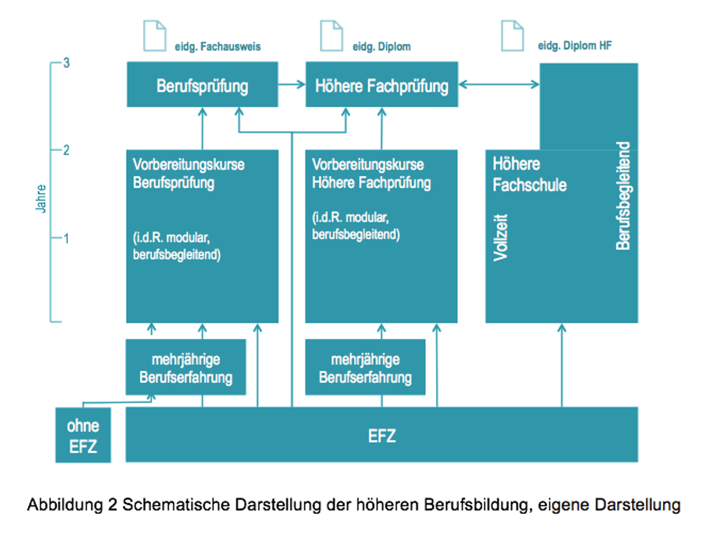{width="462px"}

:::{.source}
Nägele, C., & Bierschenk, K. (2014). Höhere Berufsbildung im Bildungsraum Nordwestschweiz [Higher vocational education and training in the education area of Northwestern Switzerland]. Pädagogische Hochschule FHNW, Institut Forschung und Entwicklung, Zentrum Lernen und Sozialisation.
:::

## Berufsbildung Schweiz {.section-slide}

# Steuerung

- Verfassung (Art. 63)
- Berufsbildungsgesetz (BBG)
- Berufsbildungsverordnung (BBV)
- Verordnung über die berufliche Grundbildung
- Bildungsplan
- Qualifikationsprofil

# Bundesverfassung der Schweizerischen Eidgenossenschaft

**Art. 63 Berufsbildung**

1 Der Bund erlässt Vorschriften über die Berufsbildung.  

2 Er fördert ein breites und durchlässiges Angebot im Bereich der Berufsbildung.

Angenommen in der Volksabstimmung vom 21. Mai 2006, in Kraft seit 21. Mai 2006.

:::{.links}
[https://www.fedlex.admin.ch/eli/cc/1999/404/de](https://www.fedlex.admin.ch/eli/cc/1999/404/de)
:::

# Bundesgesetz über die Berufsbildung, *(Berufsbildungsgesetz, BBG)*

**Art. 1 Grundsatz**

Die Berufsbildung ist eine gemeinsame Aufgabe von Bund, Kantonen und Organisationen der Arbeitswelt. Sie streben ein genügendes Angebot im Bereich der Berufsbildung, insbesondere in zukunftsfähigen Berufsfeldern, an.

:::{.links}
[https://www.fedlex.admin.ch/eli/cc/2003/674/de](https://www.fedlex.admin.ch/eli/cc/2003/674/de)
:::

# Verordnung über die Berufsbildung, *(Berufsbildungsverordnung, BBV)*

**Art. 1 Zusammenarbeit**

Die Zusammenarbeit von Bund, Kantonen und Organisationen der Arbeitswelt in der Berufsbildung dient einer hohen, landesweit vergleichbaren und arbeitsmarktbezogenen Qualifikation der Lernenden.

:::{.links}
[https://www.fedlex.admin.ch/eli/cc/2003/748/de](https://www.fedlex.admin.ch/eli/cc/2003/748/de)
:::

# Verbundaufgabe Bund

Der **Bund** nimmt eine strategische Rolle ein. Er ist insbesondere zuständig für Qualitätssicherung, Weiterentwicklung, Transparenz und Vergleichbarkeit der Angebote.

::: {.links}
[https://www.sbfi.admin.ch/de/verbundpartnerschaft](https://www.sbfi.admin.ch/de/verbundpartnerschaft)
:::

# Verbundaufgabe Kantone

Die **Kantone** sind verantwortlich für die Umsetzung der Berufsbildung und die Aufsicht über Lehrverhältnisse, Berufsfachschulen und Höhere Fachschulen. Zudem bieten sie Berufs-, Studien- und Laufbahnberatung an.

::: {.links}
[https://www.sbfi.admin.ch/de/verbundpartnerschaft](https://www.sbfi.admin.ch/de/verbundpartnerschaft)
:::

# Verbundaufgabe Organisationen der Arbeitswelt

Die **Organisationen der Arbeitswelt** gestalten die Berufsbildung strategisch, konzeptionell und inhaltlich mit. Sie legen Bildungsinhalte fest und orientieren diese am künftigen Bedarf des Arbeitsmarkts.

::: {.links}
[https://www.sbfi.admin.ch/de/verbundpartnerschaft](https://www.sbfi.admin.ch/de/verbundpartnerschaft)
:::

# SBFI

Das Staatssekretariat für Bildung, Forschung und Innovation (SBFI) ist das Kompetenzzentrum des Bundes für national und international ausgerichtete Fragen der Bildungs-, Forschungs- und Innovationspolitik.

:::{.source}
SBFI. (2023). Das SBFI auf einen Blick. SBFI Staatssekretariat für Bildung, Forschung und Innovation.
:::

::: {.links}
[https://www.sbfi.admin.ch/de](https://www.sbfi.admin.ch/de)
:::

# Kantone – Umsetzung und Aufsicht

- [Konferenz der kantonalen Erziehungsdirektorinnen und -direktoren](https://www.edk.ch/de)
- [Schweizerische Berufsbildungsämter-Konferenz (SBBK)](https://www.edk.ch/de/sbbk/)
- [Schweizerische Konferenz für Berufs-, Studien- und Laufbahnberatung (SK BSLB)](https://www.edk.ch/de/themen/transversal/bslb/skbslb)
- Kantonale Berufsbildungsämter: [AG](https://www.ag.ch/de/themen/bildung-forschung/berufsbildung), [BS](https://www.bs.ch/ed/mb), [BL](https://www.baselland.ch/politik-und-behorden/direktionen/bildungs-kultur-und-sportdirektion/berufsbildung-mittelschulen-und-hochschulen/hauptabteilung-berufsbildung), [SO](https://so.ch/verwaltung/departement-fuer-bildung-kultur-und-sport/amt-fuer-berufsbildung-mittel-und-hochschulen/)
- Berufs- und Laufbahnberatung: [AG](https://beratungsdienste.ch/), [BS](https://www.bs.ch/ed/mb/biz), [BL](https://www.baselland.ch/politik-und-behorden/direktionen/bildungs-kultur-und-sportdirektion/berufsbildung-mittelschulen-und-hochschulen/laufbahnzentrum/berufs-studien-und-laufbahnberatung), [SO](https://so.ch/verwaltung/departement-fuer-bildung-kultur-und-sport/amt-fuer-berufsbildung-mittel-und-hochschulen/berufs-studien-und-laufbahnberatung/unser-angebot/beratung/berufsberatung/)
- Berufsfachschulen: [AG](https://www.ag.ch/de/themen/bildung-forschung/berufsbildung/lehre/schulische-bildung/schulen-der-berufsbildung), [BS](https://www.bs.ch/themen/bildung-und-kinderbetreuung/schule/weiterfuehrende-schulen/berufsfachschulen), [BL](https://www.baselland.ch/politik-und-behorden/direktionen/bildungs-kultur-und-sportdirektion/bv-bksd/bmh/berufsfachschulen), [SO](https://so.ch/verwaltung/departement-fuer-bildung-kultur-und-sport/amt-fuer-berufsbildung-mittel-und-hochschulen/berufsfachschulen-bbz/)

# EDK

Die Konferenz der kantonalen Erziehungsdirektorinnen und -direktoren (EDK) unterstützt die koordinierte Umsetzung und Weiterentwicklung der Berufsbildung sowie der Berufs-, Studien- und Laufbahnberatung.

::: {.links}
[https://www.edk.ch/de/themen/berufsbildung](https://www.edk.ch/de/themen/berufsbildung)
:::

# Organisationen der Arbeitswelt {.section-slide}

Bildungsinhalte und Ausbildungsplätze

# Beispiele

- OdA Santé <https://www.odasante.ch/>
- kvschweiz <https://www.kfmv.ch/>
- Bäcker-Confisseure <https://swissbaker.ch/>
- Elektroberufe <https://www.eit.swiss/de/>
- ...

# Aufgaben der OdA

- Entwicklung von Berufsprofilen
- Erarbeitung der Bildungsverordnungen (BiVo)
- Erstellung von Bildungsplänen
- Organisation der überbetrieblichen Kurse (ÜK)
- Qualitätssicherung der beruflichen Grundbildung
- Mitarbeit bei Prüfungen und Qualifikationsverfahren

# Alle Lehrberufe

[Berufsverzeichnis SBFI](https://www.becc.admin.ch/becc/public/bvz/)

[Berufliche Grundbildung](https://www.becc.admin.ch/becc/public/bvz/beruf/grundbildungen)

# Case Management Berufsbildung (CMBB) {.section-slide}

# CMBB im BRNW

- [AG Team 1155](https://www.ag.ch/de/themen/bildung-forschung/berufsbildung/beratung-stipendien/beratung-am-uebergang-volksschule-sekundarstufe-ii/case-management-berufsbildung)
- [BS Gap](https://www.bs.ch/ed/mb/gap-berufsintegration)
- [BL Zentrum Berufsintegration](https://www.baselland.ch/politik-und-behorden/direktionen/bildungs-kultur-und-sportdirektion/berufsbildung-mittelschulen-und-hochschulen/hauptabteilung-berufsbildung/berufsintegration)
- [SO Case Management Berufsbildung für Minderjährige](https://so.ch/services/case-management-berufsbildung-anmelden)

# Eidgenössisches Berufsattest (EBA)

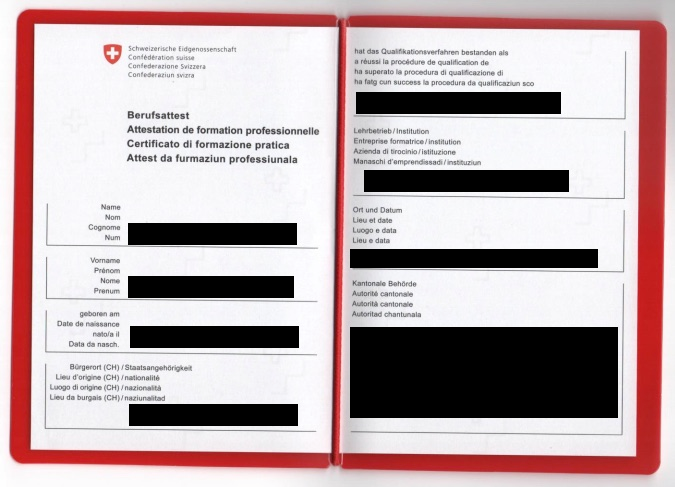

::: {.links}
[https://www.berufsberatung.ch/dyn/show/2101](https://www.berufsberatung.ch/dyn/show/2101)
:::

# Berufliche Orientierung {.section-slide}

# Lehrplan 21

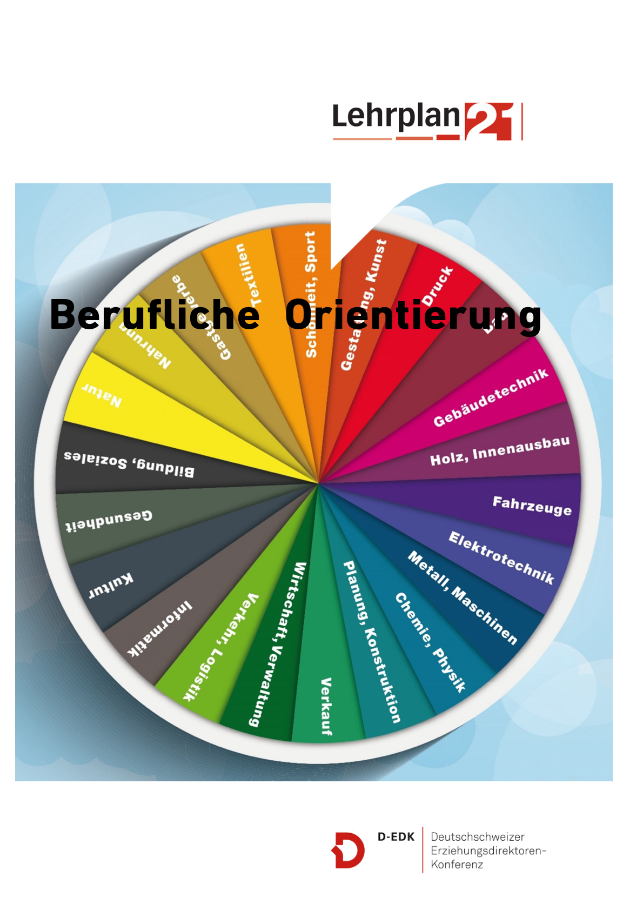{width="428px"}

::: {.source}
D-EDK. (2016). *Lehrplan 21: Gesamtausgabe* [Curriculum 21: Complete edition]. Deutschschweizer Erziehungsdirektoren-Konferenz D-EDK.
:::

::: {.links}
[https://www.lehrplan21.ch](https://www.lehrplan21.ch)
:::

# Berufliche Orientierung im Lehrplan 21

- BO.1 Persönlichkeitsprofil
- BO.2 Bildungswege, Berufs- und Arbeitswelt
- BO.3 Entscheidung und Umgang mit Schwierigkeiten
- BO.4 Planung, Umsetzung und Dokumentation

::: {.source}
D-EDK. (2016). *Lehrplan 21: Gesamtausgabe* [Curriculum 21: Complete edition]. Deutschschweizer Erziehungsdirektoren-Konferenz D-EDK.
:::

# Ziel des Unterrichts in Beruflicher Orientierung

Der Unterricht begleitet Jugendliche in ihren Schritten Richtung Anschlusslösung auf der Sekundarstufe II. Er vermittelt die Gleichwertigkeit beruflicher und schulischer Bildung sowie die Durchlässigkeit des Bildungssystems.

Ziel ist, dass alle Jugendlichen einen bewussten Entscheid für ihre Anschlusslösung treffen können.

::: {.source}
D-EDK. (2016). *Lehrplan 21: Gesamtausgabe* [Curriculum 21: Complete edition]. Deutschschweizer Erziehungsdirektoren-Konferenz D-EDK.
:::

# Schul- und Berufsorientierung in den Kantonen

::: {.source}
Nägele, C., & Schneitter, J. (2016). *Schul- und Berufsorientierung in den Kantonen. Schlussbericht zuhanden der Schweizerischen Konferenz der kantonalen Erziehungsdirektoren EDK*. Pädagogische Hochschule FHNW.
:::

::: {.links}
[https://irf.fhnw.ch/handle/11654/25345](https://irf.fhnw.ch/handle/11654/25345)
:::

# Digitale Begleitung im Berufswahlprozess digibe

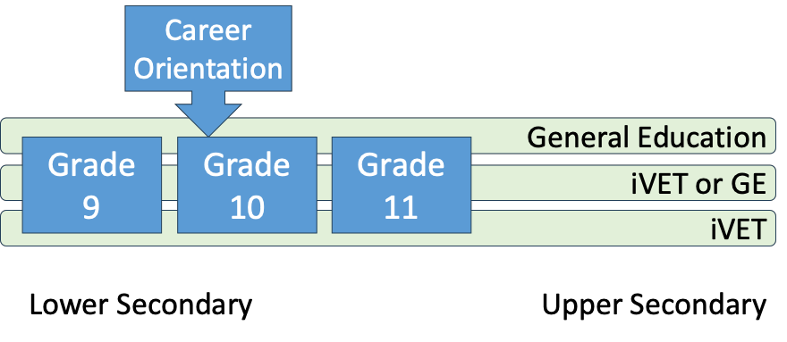

::: {.source}
Wyss, A., Weich, M., & Nägele, C. (2025). Stimulating career planning reflection in students’ works through an online intervention. In C. Nägele, B. E. Stalder, F. Kaiser, M. Malloch, & N. Kersh (Eds.), *Trends in vocational education and training research* (Vol. 8, pp. 308–314). OAPublishing/VETNET.
:::

::: {.links}
[https://doi.org/10.21240/vetcon/2025/ecer/49](https://doi.org/10.21240/vetcon/2025/ecer/49)
:::

# digibe: nicht-lineare Verläufe

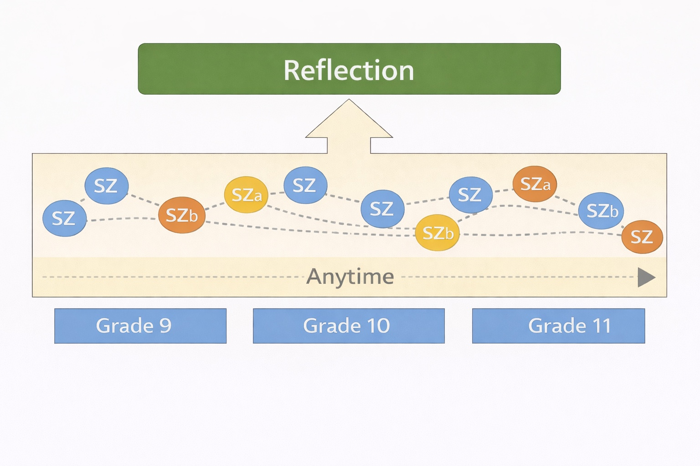

::: {.source}
Nägele, C., Stalder, B. E., & Wyss, A. (2025). Die Berufswahl ist kein linearer Prozess. Transfer. Berufsbildung in Forschung und Praxis, 10(13). https://transfer.vet/die-berufswahl-ist-kein-linearer-prozess/
:::

# Informationssetting – Reflexion: Lernen

**Lernen in der Wirtschafts- oder Fachmittelschule**  
Beschreiben Sie, wie Sie sich das Lernen in der WMS/FMS vorstellen.

**Lernen in der beruflichen Grundbildung**  
Beschreiben Sie, wie Sie sich das Lernen in der beruflichen Grundbildung vorstellen.

::: {.source}
Nägele, C., Hell, B., Rodcharoen, P., Armoneit, C., & BKSD, K. B. (2017). *Informationssetting Kanton Basel-Landschaft. Details der Aufgaben 1 bis 9* [Information setting Canton Basel-Landschaft]. Bildungs-, Kultur- und Sportdirektion (BKSD) Kanton Basel-Landschaft, Fachhochschule Nordwestschweiz, Pädagogische Hochschule und Fachhochschule Nordwestschweiz sowie Hochschule für Angewandte Psychologie.
:::

# Vorstellungen vom Lernen

|  |  |  |
|---|---|---|
| **Schule** | **Inhalt** | **Beispiel** |
| Theorie | Lernen ist theorieorientiert, wissensbasiert oder prüfungsbezogen. | Ich mache Lernkarten nach jeder Lektion, um den Stoff besser zu behalten. |
| Selbstorganisiert | Selbständiges, eigenverantwortliches oder selbstorganisiertes Lernen. | Man muss sich selber motivieren und planen, was man lernt. |
| **Lehre** |  |  |
| Praktisch | Lernen durch Handeln, Anwenden und Ausprobieren im realen Umfeld. | Ich lerne, indem ich die Arbeit direkt mache und übe. |
| Angeleitet | Lernen unter Anleitung oder Aufsicht einer Fachperson. | Am Anfang zeigt der Chef, wie es geht, später macht man es allein. |

# Berufs-, Studien- und Laufbahnberatung

Die Berufs-, Studien- und Laufbahnberatung (BSLB) ist heute ein Service Public für die gesamte Bevölkerung.

::: {.links}
[EDK Newsletter](https://www.edk.ch/de/dokumentation/newsletter/4-2023-fokus) 
[https://www.berufsberatung.ch/](https://www.berufsberatung.ch/)
:::

# Termin 2 {.section-slide}

# Herausforderungen Berufsorientierung

- zunehmende Komplexität von Bildungswegen
- mehr Übergänge im Lebenslauf
- steigende Anforderungen an Selbststeuerung
- Entscheidungen unter Unsicherheit
- ...

::: {.links}
[Herausforderungen](https://drive.switch.ch/index.php/s/SIRE0zAbeOrwy9Z)
:::

# Person–Beruf-Passung

Menschen wählen Berufe, die zu ihren Fähigkeiten und Interessen passen.

**Beispiele**

- Parsons (Trait-and-Factor)
- Holland (RIASEC)

**Ziel**

→ optimale Passung zwischen Person und Arbeitsumwelt

::: {.source}
Parsons, F. (1909). Choosing a vocation. Houghton Mifflin Company.
Tarnai, C., & Hartmann, F. G. (2015). Berufliche Interessen. Beiträge zur Theorie von J. L. Holland. Waxmann.
:::

# Parsons 

- In the wise choice of a vocation there are three broad factors: 
  (1) a clear understanding of yourself, your aptitudes, abilities, interests, ambitions, resources, limitations, and their causes; 
  (2) a knowledge of the requirements and conditions of success, advantages and disadvantages, compensation, opportunities, and prospects in different lines of work; 
  (3) true reasoning on the relations of these two groups of facts.

::: {.source}
Parsons, F. (1909). Choosing a vocation. Houghton Mifflin Company.
:::

# Holland: RIASEC-Modell

**Sechs Interessentypen**

- Realistic. Praktisch-technische Orientierung
- Investigative: Intellektuell-forschende Orientierung
- Artistic: Künstlerisch-sprachliche Orientierung
- Social: Soziale Orientierung
- Enterprising: Unternehmerische Orientierung
- Conventional: Konventionelle Orientierung

**Grundidee**

Menschen suchen Arbeitsumwelten, die ihren Interessen entsprechen.

::: {.source}
Eder, F. T., & Bergmann, C. (2015). Das Person-Umwelt-Modell von J. L. Holland: Grundlagen—Konzepte—Anwendungen. In C. Tarnai & F. G. Hartmann (Eds), *Berufliche Interessen. Beiträge zur Theorie von J. L. Holland* (pp. 11–43). Waxmann.
Holland, J. L. (1959). A theory of vocational choice. *Journal of Counseling Psychology, 6*(1), 35–45.
:::

# Anwendung

[BIZ Zürich Berufsinteressen](https://berufswahl.zh.ch/berufsinteressentest)

[Berufe-Explorer](https://www.berufsberatung.ch/dyn/show/147350)  

[Checks und Anforderungsprofile](https://support.ibe-edu.ch/check-ergebnisse-und-anforderungsprofile-fuer-schuelerinnen-und-schueler)

:::{.source}
Eine Einordnung: Rüfenacht, K. (2020). Anforderungsprofile.ch: Schulische Instrumente für die Berufswahl und -vorbereitung (p. 27) [Anforderungs-profile.ch: School tools for career choice and preparation]. Generalsekretariat EDK, Koordinationsbereich II «Berufsbildung und Sekundarstufe II / Allgemeinbildung».
:::

# Kritik an klassischen Modellen

- zu statisch
- wenig Kontextbezug
- wenig soziale Einflüsse
- berufliche Entwicklung als einmalige Entscheidung

→ Neuere Modelle verstehen Laufbahn als Entwicklungsprozess.

# Super: Life-Span, Life-Space Theory

Berufswahl ist ein lebenslanger Entwicklungsprozess.

**Phasen**

- Growth
- Exploration
- Establishment
- Maintenance
- Disengagement

**Zentrale Idee**

Das berufliche Selbstkonzept entwickelt sich über die Zeit.

:::{.source}
Super, D. E. (1994). Der Lebenszeit-, Lebensraumansatz der Laufbahnentwicklung. In D. Brown & L. Brooks (Eds.), Karriere Entwicklung (pp. 211–280). J.G. Cotta’sche Buchhandlung Nachfolger GmbH.
:::

# Regenbogen der Lebenslaufbahn

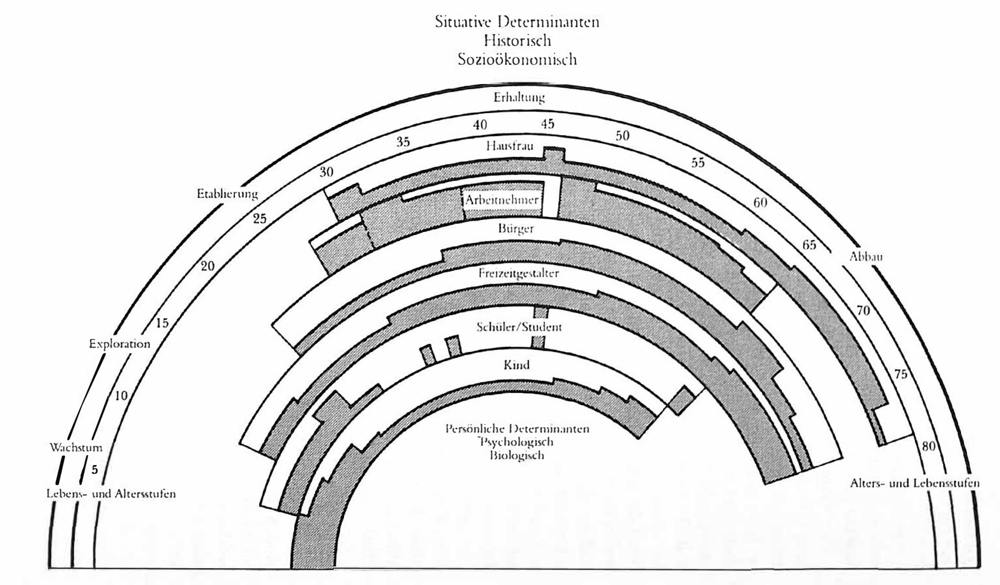

:::{.source}
Super, D. E. (1994). Der Lebenszeit-, Lebensraumansatz der Laufbahnentwicklung. In D. Brown & L. Brooks (Eds.), Karriere Entwicklung (pp. 211–280). J.G. Cotta’sche Buchhandlung Nachfolger GmbH.
:::

# Social Cognitive Career Theory

**Wichtige Einflussfaktoren**

- Selbstwirksamkeit
- Ergebniserwartungen
- Ziele

**Zusätzlich**

- soziale Unterstützung
- Barrieren
- Lern- und Erfahrungskontexte

→ Berufliche Entscheidungen entstehen im Zusammenspiel von Person und Kontext.

:::{.source}
Lent, R. W., & Brown, S. D. (2019). Social cognitive career theory at 25: Empirical status of the interest, choice, and performance models. Journal of Vocational Behavior, 115(4), 103316. https://doi.org/10.1177/1069072719852736
:::

# Social Cognitive Career Theory

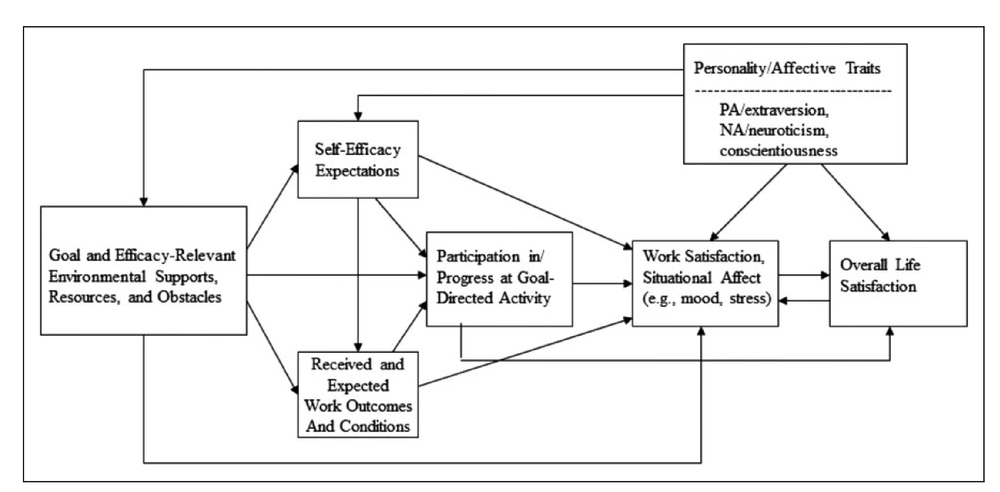

:::{.source}
Lent, R. W., & Brown, S. D. (2019). Social cognitive career theory at 25: Empirical status of the interest, choice, and performance models. Journal of Vocational Behavior, 115(4), 103316. https://doi.org/10.1177/1069072719852736
:::

# Career Construction Theory

*(Savickas)*

Laufbahnen werden aktiv konstruiert.

**Wichtige Konzepte**

- Career adaptability
- Lebensgeschichten
- individuelle Sinngebung

**Leitfrage**

Wie gestalten Menschen ihre Laufbahn in unsicheren Kontexten?

# CASS 1-12

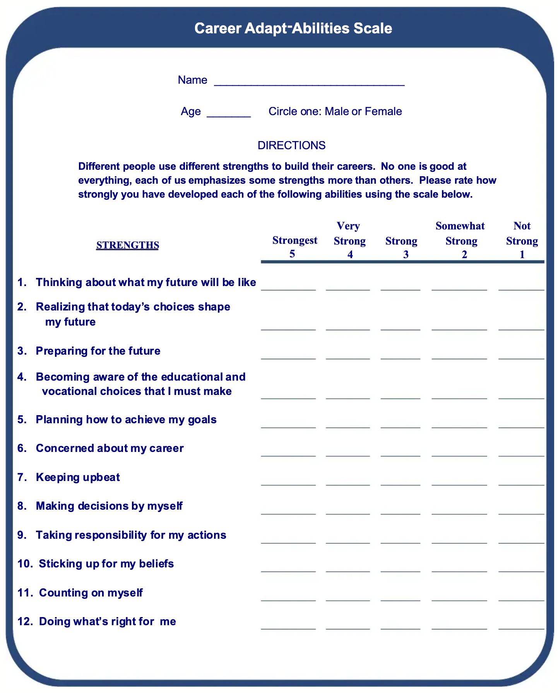

# CAAS 12 -24

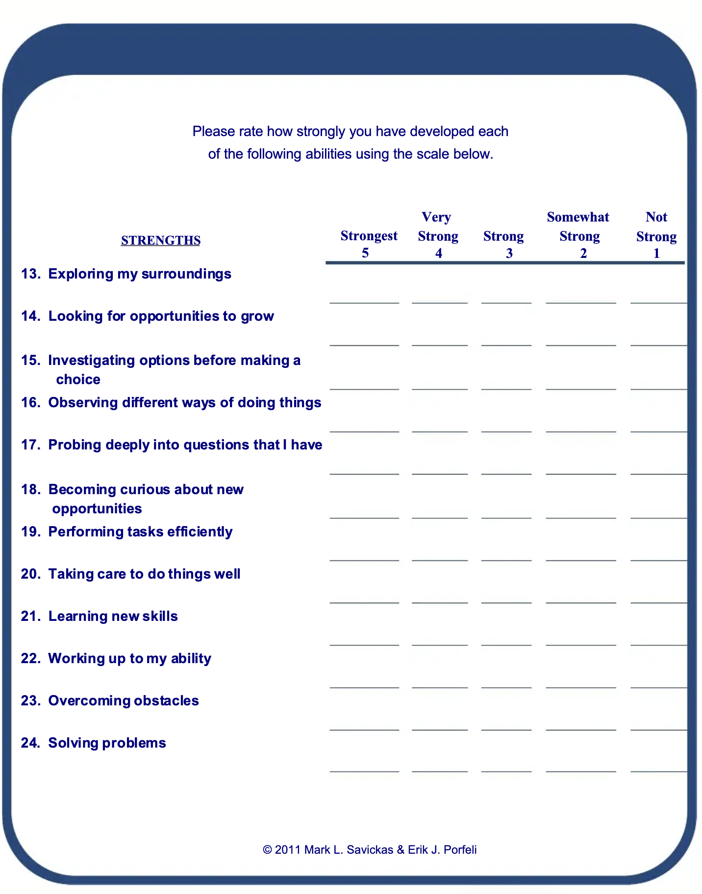

# CAAS Key

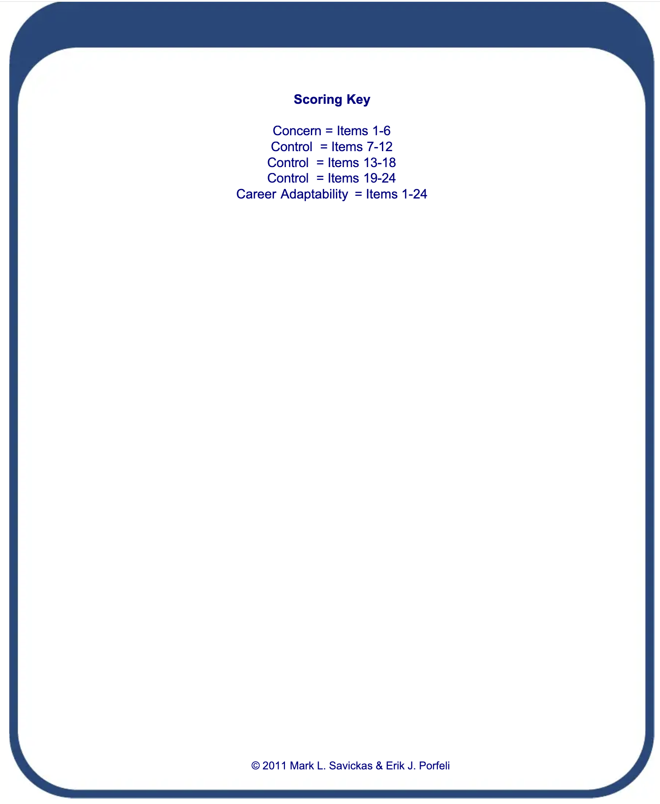

# Carer Adaptability

| Dimension | Deutsch | Items | Pädagogische Implikation |
|---|---|---|---|
| Concern | Zukunftsorientierung | 1–6 | Zukunftsgespräche, Reflexionsaufgaben |
| Control | Selbststeuerung | 7–12 | Entscheidungsübungen, Portfolioarbeit |
| Curiosity | Exploration | 13–18 | Praktika, Berufserkundungen |
| Confidence | Zuversicht | 19–24 | Feedback, Erfolgserlebnisse |

:::{.source}
Savickas, M. L., Nota, L., Rossier, J., Dauwalder, J.-P., Duarte, M. E., Guichard, J., Soresi, S., Van Esbroeck, R., & van Vianen, A. E. M. (2009). Life designing: A paradigm for career construction in the 21st century. Journal of Vocational Behavior, 75(3), 239–250. https://doi.org/10.1016/j.jvb.2009.04.004
:::

# Berufsorientierung als Lernprozess

- Exploration von Berufen
- Reflexion eigener Interessen
- Erfahrungen in Arbeitskontexten

**Beispiele**

- Praktika
- Projekte
- Gespräche mit Fachpersonen

:::{.source}
Krumboltz, J. D. (2009). The happenstance learning theory. Journal of Career Assessment, 17(2), 135–154. https://doi.org/10.1177/1069072708328861
:::

# Career Management Skills

**Wichtige Kompetenzen**

- Selbstreflexion
- Informationssuche
- Entscheidungsfähigkeit
- Planung
- Umgang mit Unsicherheit

→ Ziel: Laufbahnen selbst steuern können.

# Career Learning

Berufsorientierung als Teil von Bildung

**Elemente**

- Unterricht zu Beruf und Arbeit
- Lerngelegenheiten ausserhalb der Schule
- Reflexion von Erfahrungen

→ Verbindung von Schule, Arbeitswelt und Beratung

:::{.source}
Krumboltz, J. D. (2009). The happenstance learning theory. Journal of Career Assessment, 17(2), 135–154. https://doi.org/10.1177/1069072708328861
:::

# Berufswahlbereitschaft

:::{.source}
Marciniak, J., Steiner, R., & Hirschi, A. (2019). Berufswahlbereitschaft bei Jugendlichen – Welche Faktoren sind für eine erfolgreiche Berufswahl wichtig. BWP, 1, 6–9.
:::

# Berufsorientierung umfasst:

- Interessenentwicklung
- Exploration
- Entscheidungsprozesse
- Lern- und Entwicklungserfahrungen

**Zentrale Perspektiven**

- Passung
- Entwicklung über die Lebensspanne
- Bereitschaft
- Bedeutung von Kontext, Lernen und Reflexion

:::{.source}
Wyss, A., Weich, M., & Nägele, C. (2025). Stimulating career planning reflection in students’ works through an online intervention. In C. Nägele, B. E. Stalder, F. Kaiser, M. Malloch, & N. Kersh (Eds.), Trends in vocational education and training research (Vol. 8, pp. 308–314). OAPublishing/VETNET. https://doi.org/10.21240/vetcon/2025/ecer/49
:::

